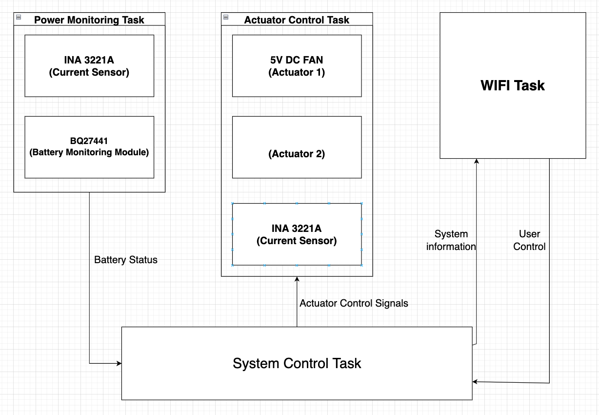
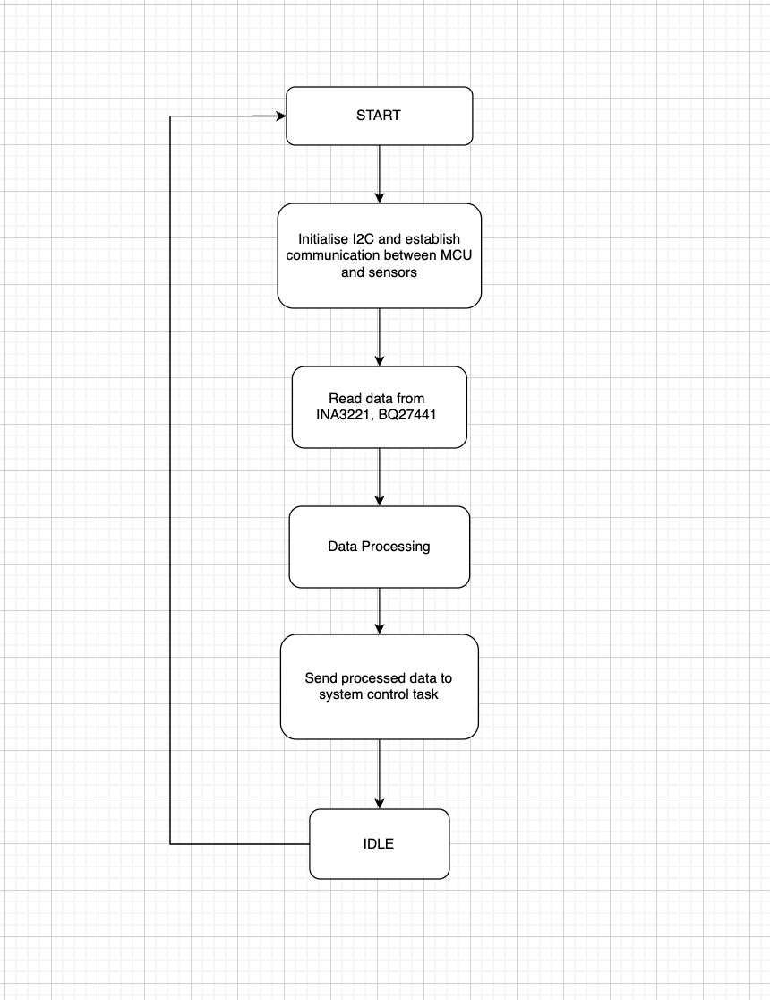
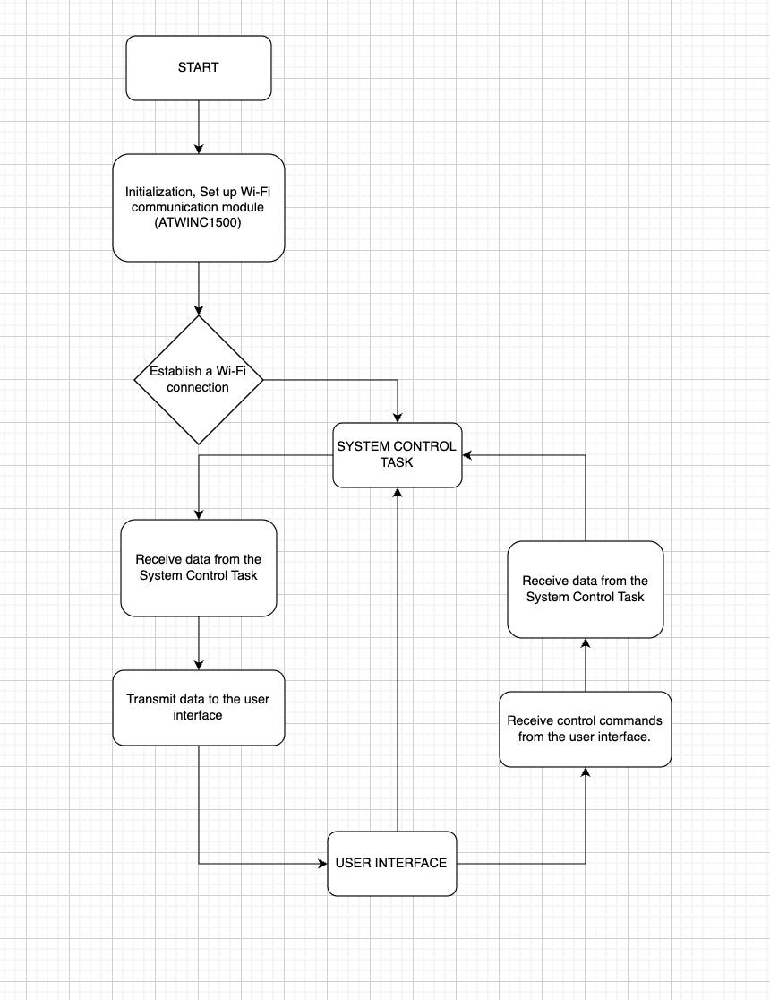
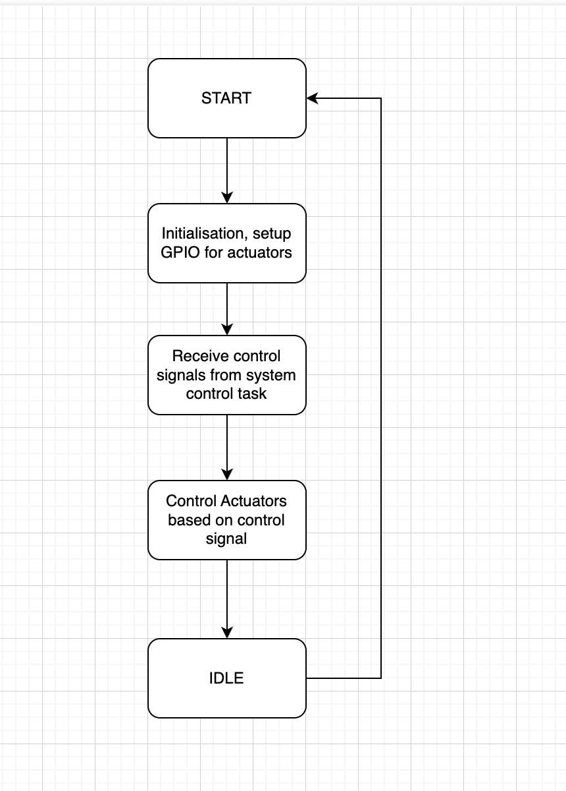
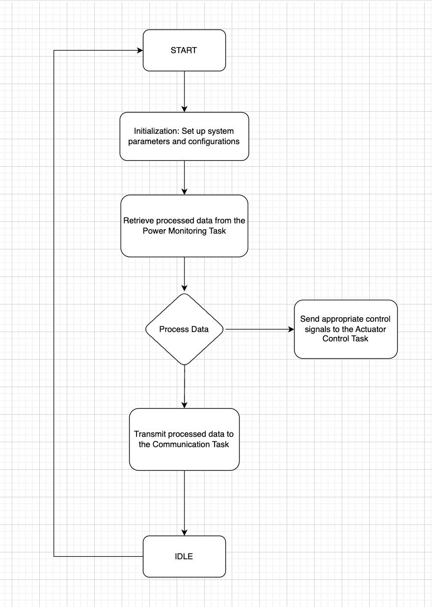
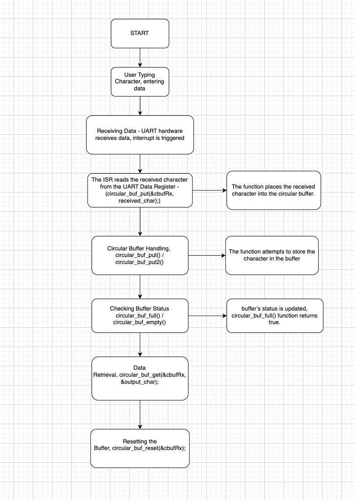
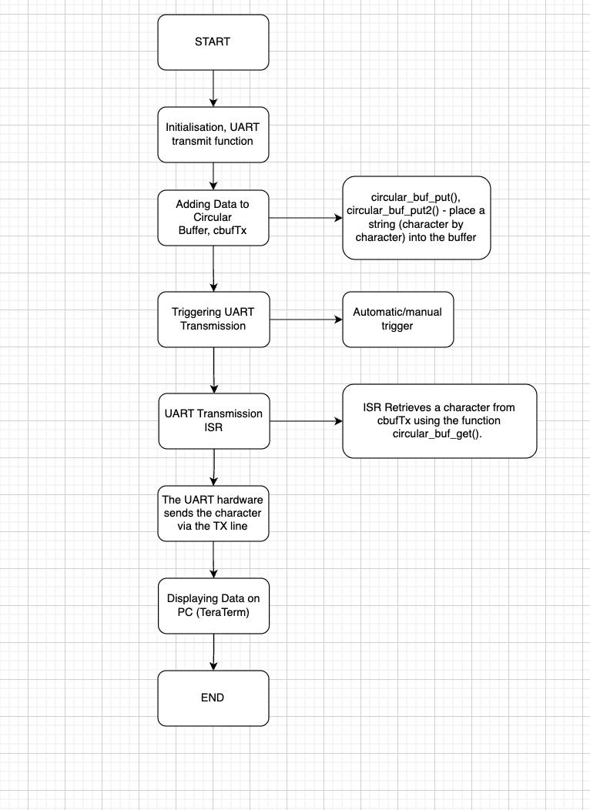
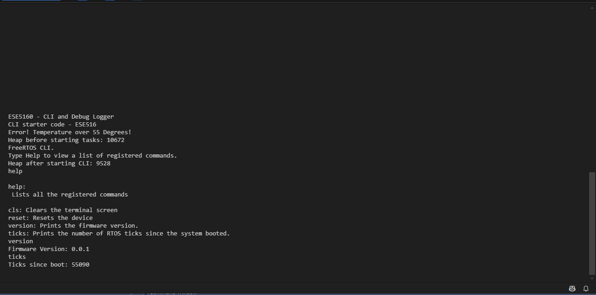
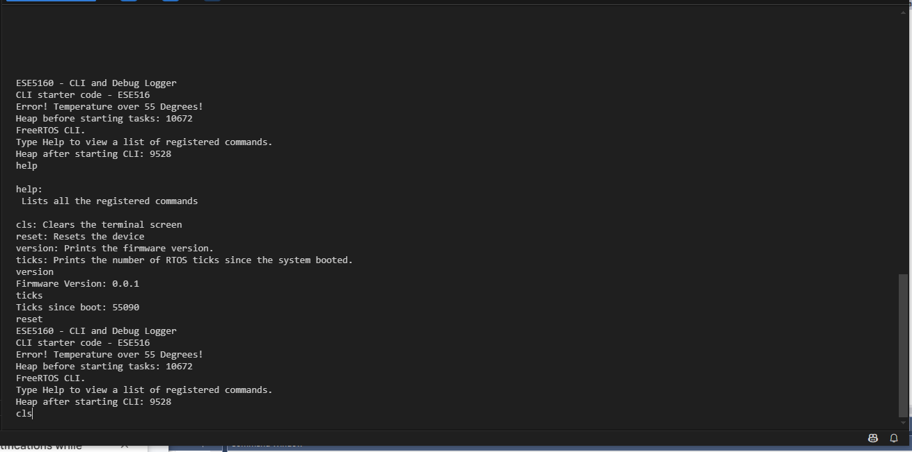
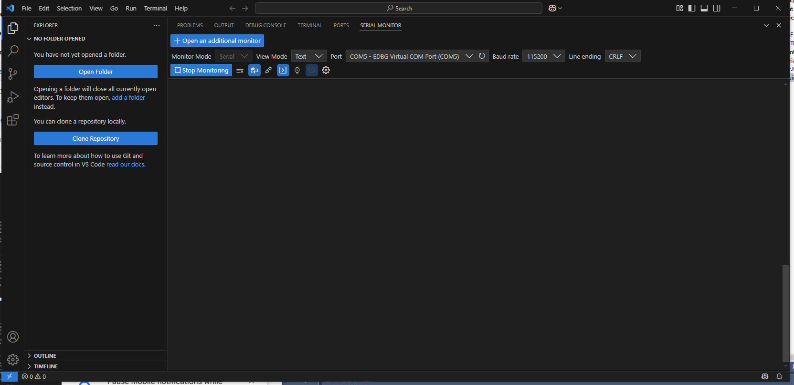

### a07g-exploring-the-CLI

* Team Number: 15
* Team Name: Rocketman
* Team Members: Surya Sandeep Akella, Dhruv Kushalkar
* GitHub Repository URL: https://github.com/ese5160/final-project-a07g-a14g-t15-rocketman#
* Description of test hardware: (development boards, sensors, actuators, laptop + OS, etc)

### **1. Software Architecture**

## Hardware Requirements Specification (HRS)

* **HRS 01:** The project shall be based on a Microchip SAMW25 microcontroller with integrated Wi-Fi, running at a minimum clock frequency of 32 MHz.
* **HRS 02:** An triple-channel current sensor shall be used to monitor the individual current/voltage draw of each actuator (Antenna, LED, DC fan) via the I²C bus.
* **HRS 03:** A fuel gauge breakout shall be included to measure battery State of Charge (SoC) and estimate run time remaining, interfacing via I²C.
* **HRS 04:** Three actuators (Antenna, LED, DC fan) shall each be powered through a relay (or suitable driver) under the control of the SAMW25’s GPIO pins.
* **HRS 05:** The LED load shall be rated at 3.3–5 V DC and must be able to be switched on/off for demonstration of low-power consumption control.
* **HRS 06:** The DC fan shall operate at 3.3–5 V DC with a maximum current draw of 200 mA, switched on/off for cooling or load demonstration.
* **HRS 07:** The system’s battery shall be a single-cell Li-ion (3.7 V nominal, 4.2 V max), providing power for the SAMW25, sensors, and actuators.
* **HRS 08:** A stable 3.3 V rail shall be maintained (via regulator or buck-boost) for the SAMW25 and related ICs, considering battery voltage variations (3.0–4.2 V).
* **HRS 09:** The system shall support I²C communication at up to 400 kHz to ensure timely sensor data acquisition from both Current sensor and Battery monitoring modules.
* **HRS 10:** Physical connectors or headers shall be provided for easy access to I²C lines and power lines during development and testing.

## Software Requirements Specification (SRS)

1. **SRS 01**
   The system shall run under FreeRTOS with three tasks.
2. **SRS 02**
   The current sensors shall be read at a configurable interval (default 1 second, ± 100 ms tolerance), capturing per-actuator current and bus voltage.
3. **SRS 03**
   The battery fuel gauge shall be read at least once every 2 seconds to obtain SoC and estimated run time, with ±200 ms tolerance.
4. **SRS 04**
   The Wi-Fi Dashboard shall display real-time data, including:
   * Current draw per actuator (mA)
   * Battery SoC (%) and run time estimate (minutes)
   * Manual toggle switches for the Antenna, LED, and Fan
   * System alerts (e.g., “Battery Low”)
5. **SRS 05**
   The system shall allow manual override commands from the dashboard to immediately switch an actuator on/off, overriding the automated load-balancing logic.
6. **SRS 06**
   The firmware shall handle actuator state changes non-blocking, ensuring critical tasks (sensor polling) are not delayed by relay switching.
7. **SRS 07**
   The system shall display an alert on the Wi-Fi dashboard when the battery temperature exceeds 45°C, indicating potential thermal risks.
8. **SRS 08**
   The firmware shall support OTA (Over-the-Air) updates for future improvements, with safeguards to prevent incomplete updates from bricking the system.

#### System Software Architecture

#### Power Monitoring Task

#### Communication Task

#### Actuator Control Task

#### System Control Task

### **2. Understanding the Starter Code**

**Q1. What does “InitializeSerialConsole()” do? In said function, what is “cbufRx” and “cbufTx”? What type of data structure is it?**

void InitializeSerialConsole(void)

* Initializes the serial communication interface (USART) for transmitting and receiving data using circular buffers and interrupt-driven I/O.

cbufRx = circular_buf_init((uint8_t *)rxCharacterBuffer, RX_BUFFER_SIZE);

* Initializes a circular (ring) buffer for  **receiving data** .
* `rxCharacterBuffer` is a pre-defined byte array that stores incoming characters.
* `RX_BUFFER_SIZE` is the capacity of the RX buffer.
* `circular_buf_init()` is likely a helper function that sets up internal pointers for head, tail, and flags.

cbufTx = circular_buf_init((uint8_t *)txCharacterBuffer, TX_BUFFER_SIZE);

* **What it does** : Initializes a circular buffer for  **transmitting data** .
* `txCharacterBuffer` stores characters waiting to be sent.
* `TX_BUFFER_SIZE` is its maximum size.

configure_usart();

* Sets up the USART peripheral hardware:
  * SERCOM4 as USART
  * Baud rate
  * Data bits, parity, and stop bits
  * TX and RX pinmux settings
  * Asynchronous mode

configure_usart_callbacks();

* Registers ISR callback functions for:
  * RX Complete
  * TX Complete
  * Error detection

NVIC_SetPriority(SERCOM4_IRQn, 10);

* Sets the priority of the `SERCOM4` interrupt to `10`.
* Lower value = higher priority.
* Ensures USART interrupts are handled timely but don’t block critical system interrupts.

usart_read_buffer_job(&usart_instance, (uint8_t *)&latestRx, 1);

* Initiates an **asynchronous 1-byte read** operation.
* Data will be read into `latestRx`.
* When a character is received, a **callback** (configured earlier) will handle it.

The function `InitializeSerialConsole()` is responsible for setting up the serial communication interface (USART) on a microcontroller (likely a SAMW25 or similar), so it can send and receive data via a serial console (like over USB or UART).

It performs the following actions:

* Initializes circular buffers for both receive (`RX`) and transmit (`TX`) data.
* Configures the USART hardware , such as baud rate, data format, and the SERCOM module being used.
* Registers and enables USART interrupt callbacks to handle communication events (e.g., when data is received).
* Sets the interrupt priority for USART to make sure it plays nicely with other peripherals.
* Begins a non-blocking read job so the microcontroller starts listening for incoming characters.

`cbufRx` →  Receive buffer : Holds incoming serial data (from UART to your app)

`cbufTx` →  Transmit buffer : Holds outgoing serial data (from your app to UART)

They are  **pointers to a circular buffer structure** . These buffers allow **first-in, first-out (FIFO)** behavior, which is ideal for serial communication where data must be processed in the order it is received or transmitted.

 ***Q2] How are “cbufRx” and “cbufTx” initialized? Where is the library that defines them (please list the *C file they come from).****

   They are initialized in your `InitializeSerialConsole()` function using:

    cbufRx = circular_buf_init((uint8_t *)rxCharacterBuffer, RX_BUFFER_SIZE);
	cbufTx = circular_buf_init((uint8_t *)txCharacterBuffer, TX_BUFFER_SIZE);

    `cbufRx` and `cbufTx` are most likely **pointers to a circular buffer structure** (`circular_buf_t*`). The function `circular_buf_init()` takes a pointer to a raw byte buffer and the size of that buffer, and returns a pointer to a structured circular buffer with internal metadata

Where it is defined:

| Field  | Description                                                              |
| ------ | ------------------------------------------------------------------------ |
| buffer | Pointer to the memory holding the actual bytes                           |
| head   | Index where new data is added (written)                                  |
| tail   | Index where data is read (removed)                                       |
| max    | Maximum size of the buffer (total capacity)                              |
| full   | Boolean flag that indicates whether the buffer is full and needs to wrap |

in the `.h` file, the type is probably **forward-declared** like this:

**Q3] Where are the character arrays where the RX and TX characters are being stored at the end? Please mention their name and size. Tip: Please note cBufRx and cBufTx are structures.**

| Purpose    | Array Name        | Size      | Used By | Defined In      |
| ---------- | ----------------- | --------- | ------- | --------------- |
| RX Storage | rxCharacterBuffer | 512 bytes | cbufRx  | SerialConsole.c |
| TX Storage | txCharacterBuffer | 512 bytes | cbufTx  | SerialConsole.c |

**Q4] Where are the interrupts for UART character received and UART character sent defined?**

The Callback declarations:
These two functions are the ISR callbacks that run when a UART character is sent or received.

| Interrupt Type             | Callback Function      | When It Triggers                          | Defined/Registered In                          |
| -------------------------- | ---------------------- | ----------------------------------------- | ---------------------------------------------- |
| UART Character Received    | usart_read_callback()  | When a character is received over UART    | SerialConsole.c → configure_usart_callbacks() |
| UART Character Transmitted | usart_write_callback() | When a character is finished transmitting | SerialConsole.c → configure_usart_callbacks() |

**Q5] What are the callback functions that are called when:**

1. **A character is received? (RX)**
2. **A character has been sent? (TX)**

**Callback Functions:**

1. Character Received (RX):
   * Callback Function: `usart_read_callback`
   * Purpose: This function is called when the USART peripheral receives a character. It processes the incoming data, which might involve storing it in a buffer or initiating further data handling routines.
2. Character Sent (TX):
   * Callback Function: `usart_write_callback`
   * Purpose: This function is triggered after the USART has successfully transmitted a character. It can be used to manage tasks such as sending the next byte in a sequence or signaling that the transmission is complete.

**Q6] Explain what is being done on each of these two callbacks and how they relate to the cbufRx and cbufTx buffers.**

1. usart_read_callback() – Character Received (RX)

Triggered when: A new character arrives from the UART peripheral (SERCOM4).

What it does: Reads the received character (already placed into latestRx by the async read job). Pushes that character into the circular receive buffer (cbufRx). Re-initiates another asynchronous read to keep receiving continuously.

Relation to cbufRx: It calls a function like circular_buf_put(cbufRx, latestRx); This stores the character into the rxCharacterBuffer[], which cbufRx manages.

Purpose: Ensures every character received from the UART is captured in the circular buffer. Makes data available for higher-level application logic (e.g., command parser).

2. usart_write_callback() – Character Sent (TX)

Triggered when: The USART finishes transmitting a character.

What it does: Checks if there is more data to send in the TX buffer (cbufTx). If data exists, reads the next character from the buffer. Kicks off another async write job with the next character.

Relation to cbufTx: It calls something like circular_buf_get(cbufTx, &latestTx); This fetches the next character from the txCharacterBuffer[].

Purpose: Maintains a steady stream of outgoing data. Allows asynchronous, non-blocking UART transmission using buffer queuing.

**Q7] Draw a diagram that explains the program flow for UART receive – starting with the user typing a character and ending with how that characters ends up in the circular buffer “cbufRx”. Please make reference to specific functions in the starter code.**

**Q8] Draw a diagram that explains the program flow for the UART transmission – starting from a string added by the program to the circular buffer “cbufTx” and ending on characters being shown on the screen of a PC (On Teraterm, for example). Please make reference to specific functions in the starter code.**

**Q9] What is done on the function “startStasks()” in main.c? How many threads are started?**

The `StartTasks()` function **initializes application-level FreeRTOS tasks** — specifically, **one CLI (Command Line Interface) task** using `xTaskCreate()`.

 **Only one FreeRTOS task is explicitly created in `StartTasks()`** :

* **Task Name:** `CLI_TASK`
* **Task Function:** `vCommandConsoleTask()`
* **Purpose:** Likely handles user input over the serial console (you can confirm this in `CliThread.c` or `CliThread.h`)

`StartTasks()` is called from  **`vApplicationDaemonTaskStartupHook()`** , which is a **FreeRTOS hook** used for initializing things  **after the scheduler starts but before other tasks run** .

### **3. Debug Logger Module**

Made necessary changes in the code. (in SerialConsole.c)

### 4. Wiretap that Convo!

**Q1] What nets must you attach the logic analyzer to? Check how the firmware sets up the UART in SerialConsole.c**

The firmware configures **SERCOM4** as the UART module for communication between the SAMW25 and the EDBG debugger chip.

From the `samw25_xplained_pro.h` file:

#define EDBG_CDC_MODULE SERCOM4
#define EDBG_CDC_SERCOM_PINMUX_PAD2 PINMUX_PB10D_SERCOM4_PAD2  // TX
#define EDBG_CDC_SERCOM_PINMUX_PAD3 PINMUX_PB11D_SERCOM4_PAD3  // RX

Therefore, you must attach the logic analyzer to:

* **PB10** → UART TX (data from SAMW25 to PC)
* **PB11** → UART RX
* **GND** → A ground pin on the board

**Q2] Where on the circuit board can you attach / solder to?**

| Wire Color | Pin on SAMW25 Board | Signal                 | Purpose                        |
| ---------- | ------------------- | ---------------------- | ------------------------------ |
| Yellow     | PB10                | UART TX (SERCOM4 PAD2) | Captures transmitted UART data |
| Black      | GND                 | Ground                 | Connect to GND                 |

**Q3] What are critical settings for the logic analyzer?**

## Hardware Setting Picture

## Logic2 Message Capture Screenshot

## Capture File

## [.sal file of A07_T15](Images/A07G/A07G_T15.sal)

### 5. Complete the CLI

### 6. Add CLI Commands

Updated Code with necessary doxygen comments and attaching necessary screenshots here

Implementation Video Link

#### https://drive.google.com/file/d/1NL8RsHWhn5IXrZU_3po_3iivr9aCboyq/view?usp=sharing
